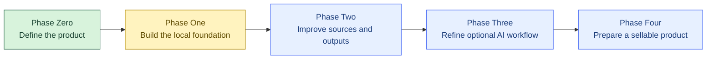
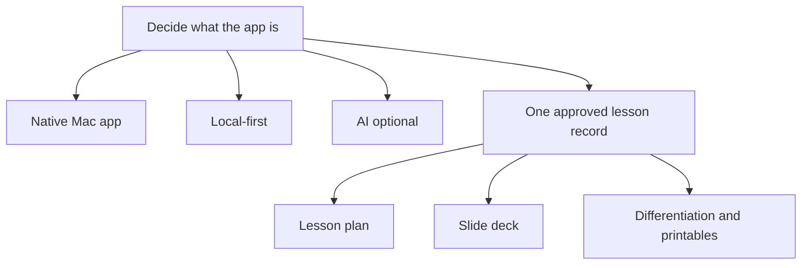
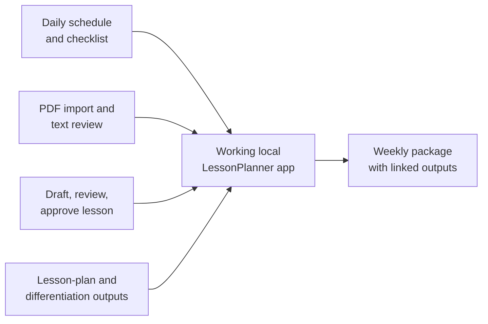
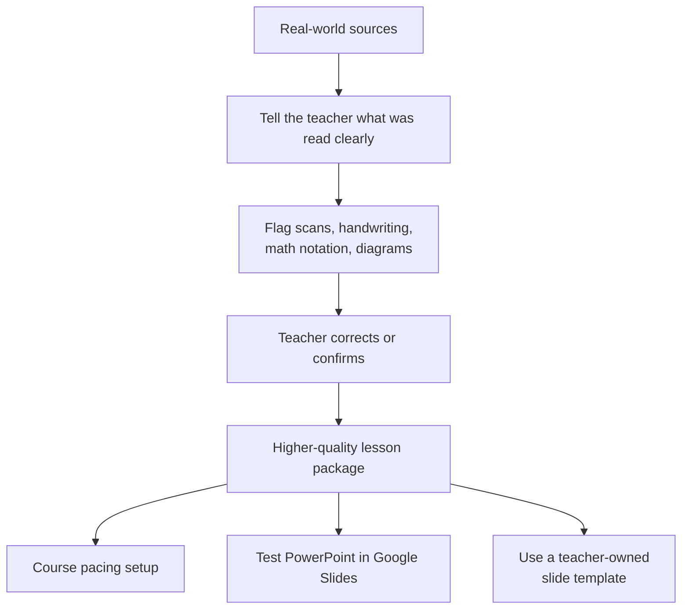
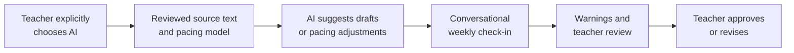
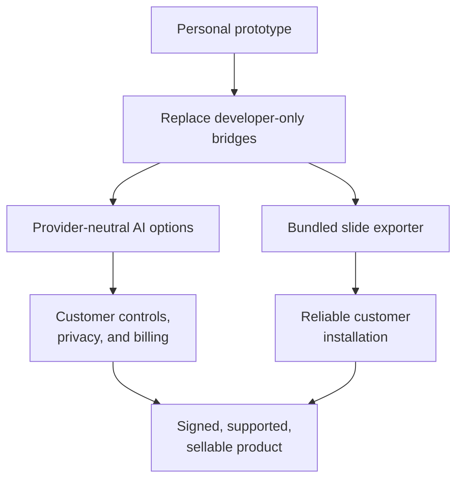
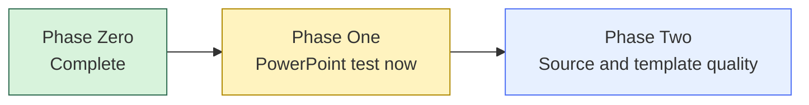

# LessonPlanner: Development Roadmap

This roadmap separates what is already established from what comes next. The project is being built in deliberate stages so that the core workflow works before advanced AI, templates, or commercial distribution are added.

## Phase Zero — Define the product

**Status: complete**

This phase established the boundaries: the app is a generic planning shell, not a school-specific curriculum tool; teacher review is required; and AI should be helpful but never required.

## Phase One — Build the local foundation

**Status: built; currently validating the newest feature**

What is already working:

- A native Mac app with a daily planner and task checklist.
- Local PDF import, text extraction, and a teacher-review step.
- Editable lesson records with draft, reviewed, and approved states.
- Local HTML lesson-plan and differentiation-guide outputs.
- An optional personal Codex CLI draft path that keeps AI outputs unapproved.
- Native PowerPoint export for approved lessons.
- Weekly package generation that creates or links the lesson plan, slide deck, and differentiation guide for scheduled approved lessons.
- Weekly planning brief fields for teacher focus, preparation notes, and student support notes, included in the generated weekly hub.
- Per-scheduled-lesson planning notes that appear in the weekly schedule and generated weekly hub.
- Editable scheduled lesson entries for correcting day, time, and weekly notes after placement.
- Weekly schedule time validation that blocks package generation when a scheduled lesson ends before or at its start time.
- Weekly package readiness guidance that blocks empty or unapproved schedules and shows per-lesson Plan, Deck, and Guide status.
- Weekly output summary counts ready lesson plans, slide decks, differentiation guides, complete scheduled lessons, and missing outputs before package generation.
- Weekly prompt preference for the teacher's chosen weekly planning day/time, with the next prompt target shown in the app.
- In-app weekly prompt banner that opens the weekly planner or dismisses the current prompt cycle.
- Local testing profiles can simulate multiple teachers with separate local caches before real login infrastructure exists.
- Active local testing profile is visible across the workspace to reduce profile/cache confusion during QA.
- Local test profiles can be created or switched from a dedicated top-level profile panel.
- Document intake accepts multiple PDF/DOCX files or folders from one picker, scans folders, and sorts imported files into setup roles for pacing and planning.
- Document intake can automatically turn readable setup documents into starter course pacing, approved lesson placeholders, and weekly planner assignments.
- Existing readable imports can backfill the weekly planner on app/profile load if pacing was not already created.
- Readable imports are usable by default; manual text edits are optional when extracted text needs correction or a blank field needs filling.
- Course pacing setup first slice: readable setup documents can produce a starter pacing model with unit, module, lesson, assessment, and timing fields.
- Course pacing setup prefers readable pacing-related documents such as pacing guides, curriculum maps, calendars, and assessment schedules.
- Course pacing setup uses summary rows and selected-unit headers to make unit/module/lesson editing easier to scan.
- Weekly pacing suggestions can populate the normal weekly schedule from approved course pacing.
- Unmatched weekly pacing suggestions can create approved lesson placeholders for teacher editing.
- Weekly check-in notes can draft structured pacing refinements that become part of course pacing only after teacher acceptance.
- Accepted pacing refinements can shift dated unit start/end dates while recording the applied adjustment.
- Course pacing supports optional unit, module, and lesson dates for more specific weekly suggestions and accepted shifts.
- Workspace includes a course pacing unit editor for teacher-reviewed manual unit timing, assessment-window, note, and skipped-day changes.
- Workspace includes course pacing module and lesson editors for teacher-reviewed manual timing and dependency changes.
- Course pacing editors validate unit, module, and lesson date ranges before saving.
- Workspace includes a local workflow QA checklist for phase-exit testing of the end-to-end prototype path.
- First template-aware slide export path: generated deck history and speaker notes carry the active presentation template and default lesson-field mappings.
- Presentation-template readiness gates that separate mapping/provenance readiness from real layout-preservation readiness.
- Presentation-template layout-plan records for source-slide inventory, output frame mapping, and fidelity-review status.
- First-pass presentation-template inspection that can populate layout inventory and frame-map candidates from readable `.pptx` slide XML, including normal compressed packages.

What remains before moving forward:

- Run the local workflow QA checklist with a test teacher profile from setup documents through weekly hub generation.
- Open the generated native deck in PowerPoint and Google Slides with a non-sensitive approved lesson.
- Record human QA findings and fix any workflow or output issues found during that pass.
- Keep local teacher profiles clearly marked as testing-only until real login, permissions, sync, and admin controls are designed.
- Decide whether OS-level notifications are needed beyond the in-app prompt, then refine the remaining weekly-package UI details.
- Extend automated template inspection for inherited slide-layout/master placeholders and fidelity QA for customer-owned PowerPoint templates.

## Phase Two — Improve source quality and output quality

**Status: planned next**

This phase makes the app more honest and useful with real documents. It should identify uncertainty rather than pretending every picture, equation, or handwritten note was understood correctly. It will also test whether exported PowerPoints remain usable after opening them in Google Slides.

Later in this phase, the teacher should be able to feed setup documents such as pacing guides, scope-and-sequence documents, curriculum maps, module outlines, and assessment calendars into the same reviewed-source pipeline. The app can then propose a teacher-reviewable course pacing model: units, modules, lessons, date ranges, instructional-day counts, assessment windows, skipped days, and dependency notes. Once approved, that pacing model becomes the governing timing layer for weekly package planning, while remaining editable as the year changes.

The owner can also provide an HTML slide-deck template. The app can then map named parts of an approved lesson into that teacher-owned visual structure.

## Phase Three — Refine optional AI help

**Status: planned later**

This phase improves convenience without changing the safety principle: AI can suggest a draft, pacing adjustment, or weekly-plan revision, but it never approves a lesson, changes the governing pacing model, or creates classroom materials for use without teacher confirmation. The weekly check-in prompt becomes the natural conversational surface for adjustments: the teacher can describe what changed, the app can suggest revised pacing or weekly schedule updates, and the teacher approves the resulting changes before they become active.

## Phase Four — Prepare the sellable version

**Status: future**

The current personal build is useful for learning and testing, but it relies on the owner’s local development environment in a few places. A sellable product must replace those pieces with supported, customer-ready systems: a bundled slide exporter, clear privacy controls, provider-neutral AI choices, template management, signing/notarization, and support documentation.

The PowerPoint exporter boundary is tracked in `SELLABLE_POWERPOINT_EXPORTER_BOUNDARY.md`. The supported exporter strategy is recorded in `POWERPOINT_EXPORTER_STRATEGY_ADR.md`: the sellable build should use a native Swift Open XML exporter rather than the personal Codex-runtime bridge.

## Current location on the roadmap

The project now has the core weekly-package shape: readable setup documents can flow directly into starter pacing, lesson placeholders, and the weekly planner; scheduled approved lessons can generate the three main outputs and a weekly hub document that links them, with a saved teacher planning brief, editable per-lesson schedule notes, schedule time validation, output status counts, readiness checks, local teacher-profile testing caches with visible active-profile state, an in-app weekly prompt flow, single-area setup document intake with role sorting and automatic weekly sync, course pacing setup with weekly suggestions, structured check-in refinements, unit/module/lesson date shifts, summary-based unit/module/lesson editors, and pacing date validation, template-aware deck provenance, explicit template-fidelity gates, persisted layout-plan records, first-pass template inspection, and a local workflow QA checklist with ready-state test coverage. The next practical activity is human-guided local workflow QA, then testing the native deck in PowerPoint/Google Slides.
