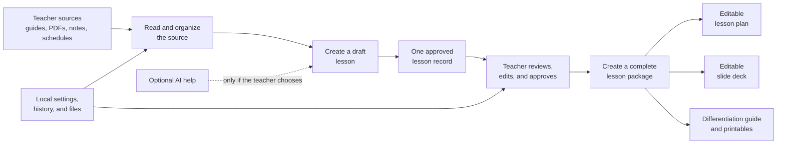
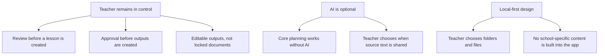

# LessonPlanner: The End Goal

LessonPlanner is intended to be a private, local-first planning companion for teachers. It turns teacher-reviewed source material into one consistent, editable lesson package—without requiring AI and without locking the teacher into Claude, Codex, or any other model.

The central idea is simple: a teacher reviews the source material once, approves one lesson record, and the app uses that same approved record to create the materials needed to teach it.

## What the teacher experiences

1. Bring in a source

   A teacher imports a guide, curriculum PDF, lesson notes, pacing information, or schedule. The app keeps the material local and lets the teacher check the extracted text before it is used.

2. Build the lesson

   The teacher can create a lesson manually, use clear rules to fill obvious labeled fields, or—if they explicitly choose—ask AI to make a draft. AI suggestions are never treated as final.

3. Review one lesson record

   The teacher sees the title, objective, sequence, materials, assessment, differentiation, and source references in one place. They edit it until it is right, then approve it.

4. Generate the materials

   The approved lesson becomes the source for a lesson plan, a slide deck, and a differentiation/printable guide. This avoids creating three disconnected versions of the same lesson.

5. Use it as a daily planning hub

   Alongside lesson work, the app is intended to provide a compact daily view with today’s schedule and checklist. Opening the app expands into the full planning workspace.

## What makes the project different

## Long-term product vision

The eventual product could be useful to individual teachers, schools, or districts because the shell is general: teachers bring their own permitted curriculum, templates, and workflows. The sellable version should use supported, provider-neutral technology, not depend on a developer’s personal Codex or Claude setup.

The goal is not to replace teacher judgment. The goal is to reduce repetitive planning work while keeping the teacher’s materials, decisions, and classroom context at the center.
